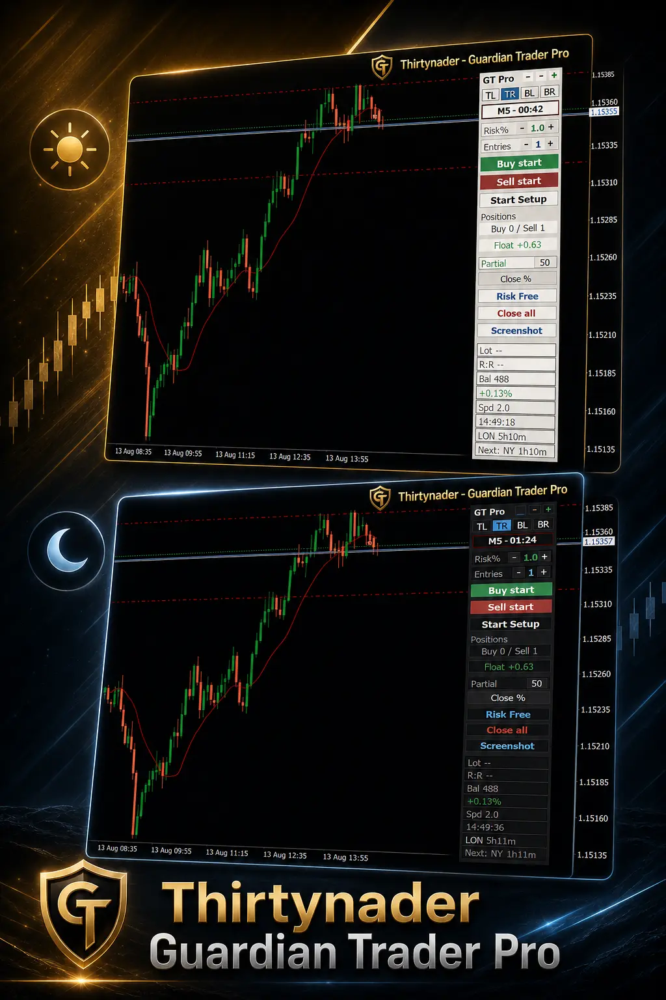
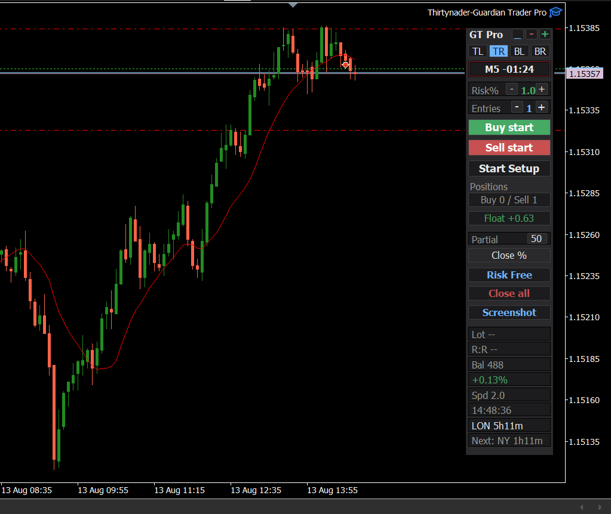
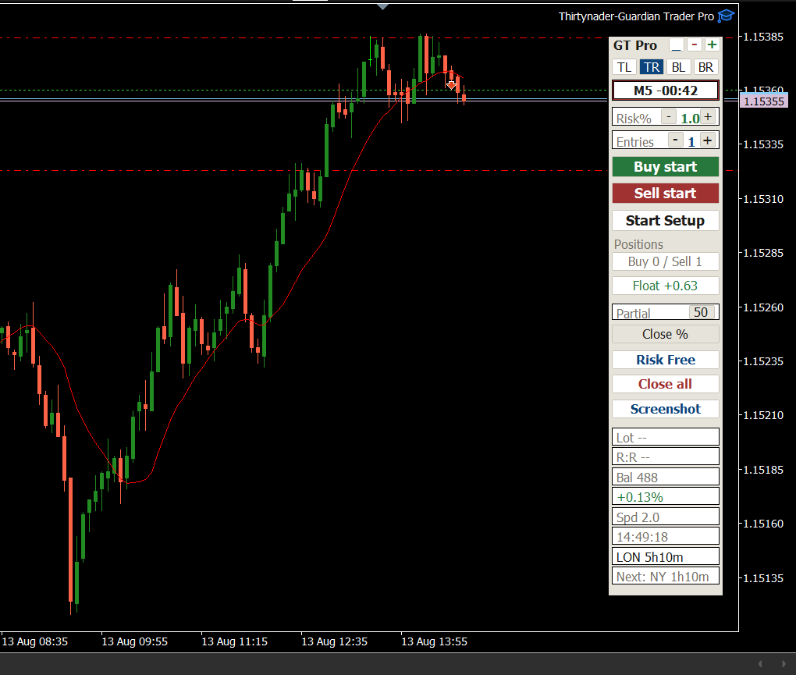
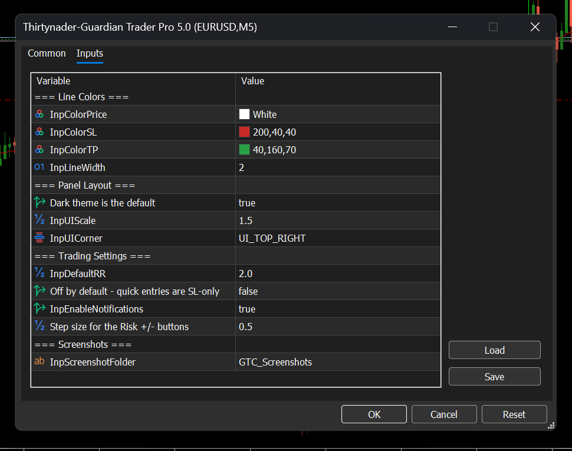

  

<h1 align="center">Guardian Trader Pro</h1>

<i>A risk-managed, one-click trading panel for MetaTrader 4 &amp; 5</i>

  <strong>100% Free &nbsp;|&nbsp; کاملا رایگان </strong>

  

  <strong>Choose your language / زبان خود را انتخاب کنید</strong>  
  <a href="#persian">🇮🇷 فارسی</a> &nbsp;|&nbsp; <a href="#english">🇬🇧 English</a>

---

  
  &nbsp;&nbsp;
  

  

---

## فارسی

### این چیه؟

Guardian Trader Pro یه پنل معاملاتی جمع‌وجوره که روی چارتتون می‌شینه و دقیقاً دو چیزی که توی هر معامله واقعاً اهمیت داره رو مدیریت می‌کنه: **چقدر ریسک می‌کنید، و چقدر سریع می‌تونید روش عمل کنید.**

به‌جای اینکه هر بار لات‌سایز رو دستی حساب کنید، یه‌بار درصد ریسک رو تنظیم می‌کنید از اون به بعد پنل خودش، بر اساس فاصله‌ی واقعی استاپ‌لاستون، حسابش می‌کنه. یه روند ورود سریع دو-کلیکی (اول خط استاپ، بعد تأیید معامله) هم یعنی وقتی بازار سریع حرکت می‌کنه، هیچ‌وقت درگیر محاسبه‌ی دستی لات نمی‌شید.

این یه سرویس سیگنال یا استراتژی نیست بهتون نمی‌گه *کِی* معامله کنید. طراحی شده که هر وقت *خودتون* تصمیم گرفتید معامله کنید، ریسکتون دقیقاً همون‌جایی بمونه که تعیین کردید.

این پروژه **کاملاً رایگان** می‌تونید آزادانه دانلود، استفاده و به بقیه هم معرفیش کنید.

### دانلود

**[⬇ دانلود آخرین نسخه](https://github.com/Thirtynader/guardian-trader-pro/releases/latest)**

### محتوای فایل دانلودی

| فایل | توضیح |
|---|---|
| `Thirtynader-Guardian Trader Pro.ex5` | فایل کامپایل‌شده و آماده‌ی اجرا برای **متاتریدر ۵** |
| `Thirtynader-Guardian Trader Pro.ex4` | فایل کامپایل‌شده و آماده‌ی اجرا برای **متاتریدر ۴** (بیلد ۶۰۰ به بالا) |
| `GuardianTraderPro_Guide.docx.docx` | راهنمای کامل کاربر (فارسی و انگلیسی، با صفحه‌ی انتخاب زبان) همه‌ی دکمه‌ها، تنظیمات و مراحل نصب رو با جزئیات کامل توضیح داده |

> فقط فایل‌های کامپایل‌شده (`.ex4` / `.ex5`) ارائه می‌شن، نه سورس‌کد — کافیه دانلود کنید و مستقیم توی پوشه‌ی `Experts` بذارید، نیازی به کامپایل کردن نیست.

> راهنما از قبل نصب، فعال‌سازی Algo Trading، و کارکرد تک‌تک دکمه‌ها رو کامل توضیح داده، برای همین این فایل رو عمداً کوتاه نگه داشتم. برای راهنمای کامل، فایل راهنما رو باز کنید.

### شروع سریع

۱. فایل متناسب با پلتفرمتون رو دانلود کنید: `.ex5` برای MT5، `.ex4` برای MT4.
۲. از مسیر `File → Open Data Folder` توی متاتریدر، فایل رو بریزید توی پوشه‌ی `MQL5\Experts` (یا `MQL4\Experts`)، بعد Navigator رو رفرش کنید یا متاتریدر رو ری‌استارت کنید.
۳. از Navigator بکشیدش روی چارت، و **Algo Trading** رو فعال کنید (اجباریه، وگرنه هیچ معامله‌ای ارسال نمی‌شه).
۴. درصد ریسک رو تنظیم کنید و آماده‌اید — برای جزئیات کامل، راهنما رو ببینید.

### سلب مسئولیت

این یه ابزار مدیریت ریسک و اجرای سریع سفارشه، نه یه سیستم سیگنال یا پیش‌بینی. همیشه خودتونید که تصمیم می‌گیرید کِی بخرید یا بفروشید. قبل از استفاده‌ی واقعی، حتماً روی حساب دمو تست کنید. هیچ ابزاری تضمین سود نمی‌ده.

### راه‌های ارتباطی

-
- ✉️ ایمیل: [Thirtynader@gmail.com]

[⬆ بازگشت به بالا](#top)

---

## English

### What is this?

Guardian Trader Pro is a compact trading panel that sits on your chart and handles the two things that actually matter on every trade: **how much you risk, and how fast you can act on it.**

Instead of manually calculating lot size for every trade, you set a risk percentage once the panel does the math for every entry from there on, based on your real stop-loss distance. A two-click quick-entry flow (place the stop, confirm the trade) means you're never fumbling with lot-size math when the market moves fast.

This isn't a signal service or a strategy it won't tell you *when* to trade. It's built to make sure that whenever *you* decide to trade, your risk stays exactly where you set it.

This project is **completely free** feel free to download, use, and share it.

### Download

**[⬇ Download the latest release](https://github.com/Thirtynader/guardian-trader-pro/releases/latest)**

### What's in the download

| File | Description |
|---|---|
| `Thirtynader-Guardian Trader Pro.ex5` | Ready-to-run compiled file for **MetaTrader 5** |
| `Thirtynader-Guardian Trader Pro.ex4` | Ready-to-run compiled file for **MetaTrader 4** (build 600+) |
| `GuardianTraderPro_Guide.docx` | Full user guide (Persian &amp; English, language-select cover page) covers every button, every setting, and installation steps in detail |

> Only the compiled files (`.ex4` / `.ex5`) are provided, not the source code just download and drop them straight into your `Experts` folder, no compiling needed.

> The guide already covers installation, enabling Algo Trading, and what every button does so this README stays short on purpose. Open the guide for the full walkthrough.

### Quick Start

1. Download the file that matches your platform: `.ex5` for MT5, `.ex4` for MT4.
2. In MetaTrader, go to `File → Open Data Folder` and drop the file into `MQL5\Experts` (or `MQL4\Experts`), then refresh the Navigator or restart MetaTrader.
3. Drag it from the Navigator onto a chart, and enable **Algo Trading** (required, or no trade will ever be sent).
4. Set your risk % and you're ready to go see the guide for the full walkthrough.

### Disclaimer

This is a risk-management and execution tool, not a signal or prediction system. You are always the one deciding when to buy or sell. Test on a demo account before using real funds. No tool guarantees profit.

### Contact

- ✉️ Email: [Thirtynader@gmail.com]

[⬆ Back to top](#top)

---

© Thirtynader — Guardian Trader Pro

